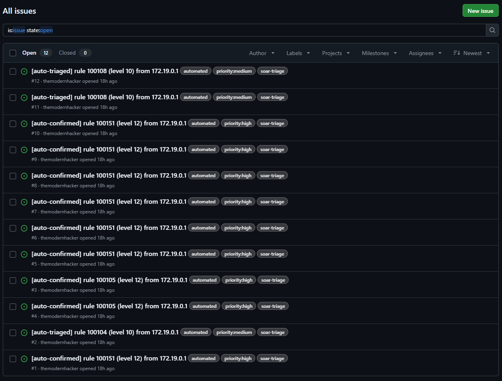

# soar-triage, Automated Triage (mini-SOAR)

Event-driven automated first-response for Wazuh alerts. The instant an alert of
level 10 or higher fires, a native Wazuh integration runs this pipeline:

```
Wazuh alert fires (level >= 10)
        |
        v
custom-soar-triage        (Wazuh integration, invoked automatically with the alert JSON)
        |
        v
enrich.py    classify the source IP, look up reputation (AbuseIPDB) if it is public
        |
        v
triage.py    a short, explainable rule set decides the disposition, and logs its reasoning
        |
        v
ticket.py    auto-files a GitHub Issue in this repo as the "ticket"
```

It closes the gap almost no junior portfolio shows: **the manual work between
"an alert fires" and "someone acts on it."** The measurable version of that is in
[`docs/writeup.md`](docs/writeup.md).

## Where this sits in the workflow

This is the third project I built, but in a real SOC it runs **between** the other
two, not after them. It is the automated step that fires the moment a detection
triggers, before a human ever opens the full investigation:

1. [`honeypot-siem`](https://github.com/themodernhacker/honeypot-siem) builds and
   tunes the **detections**.
2. **`soar-triage`** (this repo) is the **automated first-response** that runs the
   instant one of those detections fires: enrich, decide, ticket.
3. [`incident-investigation-report`](https://github.com/themodernhacker/incident-investigation-report)
   is the **human investigation** an analyst writes for the tickets that warrant it.

Detection to automated triage to investigation, the three stages of the SOC
workflow, one lab.

## What each step does

- **Enrich** ([`src/enrich.py`](src/enrich.py)) classifies the source IP locally
  first (RFC 1918 private, RFC 5737 TEST-NET, loopback, and so on) and only calls
  AbuseIPDB for a genuinely public address. A missing key, a rate limit, or a
  network error degrades gracefully to "enrichment unavailable" and never crashes
  the pipeline.
- **Triage** ([`src/triage.py`](src/triage.py)) is a short, explicit rule set an
  analyst could audit in thirty seconds, not a black box. It writes **every
  decision with its reasoning** to a log, because an automated decision needs the
  same accountability as a human analyst's.
- **Ticket** ([`src/ticket.py`](src/ticket.py)) files a **real GitHub Issue** via
  the REST API, formatted like `incident-investigation-report`'s
  `incident-ticket.md` so the three projects share one vocabulary. Open the Issues
  tab to see actual auto-filed tickets, not a screenshot claiming it works.

## Disposition logic

| Condition | Disposition | Ticket? |
|-----------|-------------|:-------:|
| level >= 12 **and** (public IP over the abuse threshold **or** a correlation rule fired) | `auto-confirmed`, high priority | yes |
| level >= 10 otherwise | `auto-triaged`, needs analyst review | yes |
| anything lower | `logged` | no |

## Proof it runs (live)

Fired against the honeypot lab, `wazuh-integratord` auto-filed a real GitHub Issue
for every level 10+ alert, in about **0.7 s each** (versus ~2 min 50 s to do the
same triage by hand). The disposition shows right in the labels: level-12
correlation alerts land `auto-confirmed / priority:high`, level-10 alerts
`auto-triaged / priority:medium`. These are live, not mocked, open the
**[Issues tab](https://github.com/themodernhacker/soar-triage/issues)** and read them.



Full walkthrough, all evidence, and the manual-vs-automated timing:
[`docs/writeup.md`](docs/writeup.md).

## Wiring it up

It hooks into Wazuh's native `wazuh-integratord` (event-driven, not polling), the
same mechanism a real SOAR product would use. Exact install and config steps:
[`integration/INTEGRATION.md`](integration/INTEGRATION.md).

## Credential hygiene

This is the first project in the series that handles a real credential, so it is
treated with care:

- The GitHub token is a **fine-grained PAT scoped to Issues on this one repo**,
  nothing broader.
- It lives only in `.env`, which is **gitignored from the first commit**.
- [`.env.example`](.env.example) shows the variable names with placeholders only.
- No token or key appears anywhere in git history.

## Testing

[`tests/test_triage.py`](tests/test_triage.py) runs with **zero API keys and no
live network**: AbuseIPDB and GitHub are both mocked. It covers every disposition
branch (below-threshold, private-IP, public-low-score, public-high-score,
correlation-rule) and asserts the reasoning log.

```bash
python -m unittest discover -s tests
```

## Lab framing, stated honestly

The alerts come from the `honeypot-siem` Cowrie honeypot on my own machine, so the
source IPs are RFC 1918 Docker gateway addresses. That means in this lab the
enrichment **classifies them locally and skips AbuseIPDB every time**, which is the
honest, expected path and is stated plainly rather than hidden. The AbuseIPDB code
path is exercised by the tests (mocked public IPs) and would light up against real
internet-facing traffic.

## Repo layout

```
integration/  the Wazuh integration script + exact wiring steps (INTEGRATION.md)
src/          enrich.py, triage.py, ticket.py, main.py
tests/        unit tests (mocked), and a sample alert fixture
docs/         writeup.md, the manual-vs-automated timing case study
evidence/     screenshots of a live run
```

---

_Companion to [honeypot-siem](https://github.com/themodernhacker/honeypot-siem)
and [incident-investigation-report](https://github.com/themodernhacker/incident-investigation-report).
Lab project for educational/defensive security use against my own infrastructure only._
