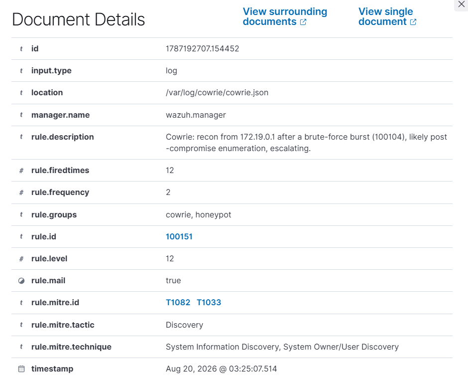
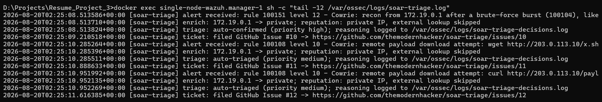
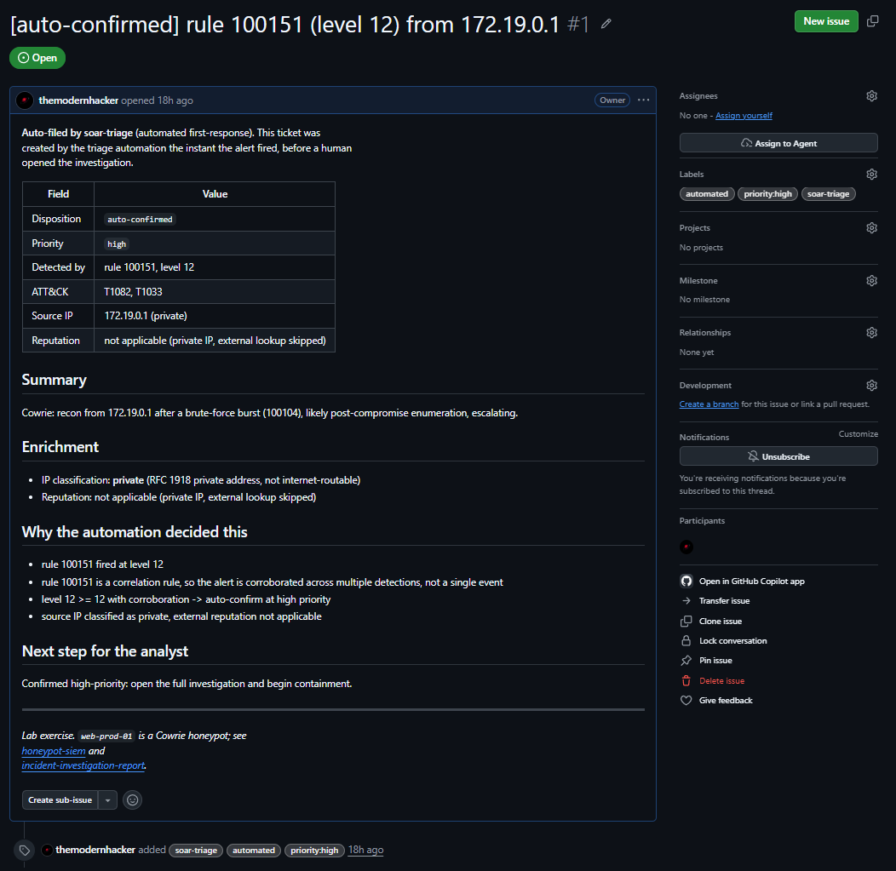
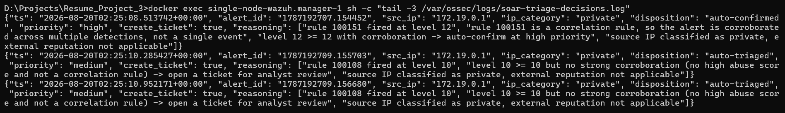

# Case study: manual vs automated triage

This is where the "impact" line on a CV comes from, and where it stays honest.
The claim is not "SOAR is faster" in the abstract; it is a measured comparison of
doing the same first-response by hand versus letting this pipeline do it, with the
caveats stated plainly.

## What is being compared

For a single Wazuh alert (level >= 10), the first-response work is the same three
steps whether a human or the automation does it:

1. **Enrich** the source IP: is it internal, or public, and if public does it have
   a reputation.
2. **Triage**: pick a disposition (confirm / needs-review / log-only) and be able
   to say why.
3. **Ticket**: write it up in a consistent format so the next person can act on it.

The automation is [`src/main.py`](../src/main.py) wired into Wazuh's
`wazuh-integratord`; the manual version is me doing the same three steps by hand.

## Method

**Manual baseline.** Do the three steps by hand, once, on one real alert from a
live run: open the alert in the Wazuh dashboard, look up the source IP's
reputation, decide a disposition, and write a ticket in the same format the
automation produces. Time it wall-clock, start to finished ticket.

**Automated run.** With the integration live, trigger the same alert and time from
the moment the alert fires to the moment the GitHub Issue is filed.

Both are timed on the same lab, the same alert type (the level 12 post-compromise
escalation, rule 100151), so it is a like-for-like comparison.

## Results

| Path | Time | How measured |
|------|------|--------------|
| Manual, by hand | **~2 min 50 s (170 s)** | wall clock, dashboard to a written ticket, one self-timed run |
| Automated, end to end | **~0.7 s typical** (0.55 to 1.1 s across the 11 Issues filed in one run) | integration trace timestamp to the filed Issue; the GitHub API round-trip dominates |
| Automated, compute only | **~0.2 ms median** (50 runs) | enrich + triage + log, measured locally; excludes the network round-trips |

Both figures are real and measured. The enrichment classification, the decision,
and the reasoning log take a fraction of a millisecond; the end-to-end automated
time is dominated entirely by the network round-trips (the GitHub Issue API call,
plus the AbuseIPDB lookup which is skipped in this lab, see below), not by the
logic. That is roughly **170 s by hand versus about 0.7 s automated** (0.55 to
1.1 s measured across the run), a reduction of well over 100x, almost all of it the
difference between a human looking things up and typing a ticket, and a program
that does not have to. The full trace of that run, every alert-received to
ticket-filed pair, is committed as
[`../evidence/live-run-trace.log`](../evidence/live-run-trace.log) so the number is
verifiable from a file, not just a screenshot.

## Honest caveats

These matter more than an inflated number:

- **The manual baseline is a single self-timed run, not a rigorous study.** One
  person, one alert, no averaging. It is indicative, not a benchmark, and the CV
  line should carry that qualifier ("reduced a single-run triage from about X to
  about Y") rather than dropping it.
- **In this lab, AbuseIPDB is always skipped.** The honeypot's attacker traffic
  comes from an RFC 1918 Docker gateway, so the enrichment classifies it locally
  and never makes the external call. That is the honest, expected path (the same
  point the IOC notes in `incident-investigation-report` make about lab
  addresses). The AbuseIPDB code path is exercised by the mocked unit tests and
  would light up on real internet-facing traffic.
- **The automation does not replace the analyst.** An `auto-confirmed` ticket is a
  head start, not a verdict: it hands a human an enriched, reasoned ticket to
  action, and it files the low-value ones so they are recorded without costing
  anyone attention. The judgment call on a confirmed incident is still a person's.

## Evidence

From the live run (all under [`../evidence/screenshots/`](../evidence/screenshots/)):

**The alert that triggered the pipeline** (Wazuh, rule 100151, level 12):

**The pipeline running**, enrich -> triage -> ticket filed, one block per alert:

**Real auto-filed tickets**, one per level 10+ alert, with the disposition visible
right in the labels (`auto-confirmed` / `priority:high` for the level-12
correlation alerts, `auto-triaged` / `priority:medium` for the level-10 ones):

**One ticket in full**, formatted like an incident ticket, carrying the reasoning
the automation used:

**The decision log**, every disposition recorded with the facts it rested on:

## What this proves

Not that automation is magic, but that the repetitive, mechanical part of
first-response, the part that is identical every time and that burns an analyst's
attention on alerts that turn out to be routine, can be done in the time it takes
a network call to return, with a full reasoning trail, and with the genuinely
interesting alerts handed to a human already enriched and prioritised.
